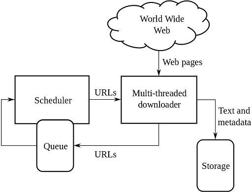

# Web Crawling

Ein Webcrawler ist ein Programm, das automatisch das WWW durchsucht und Webseiten analysiert. 
Er geht dabei folgendermassen vor:

1. Dem Webcrawler wird eine oder mehrere URLS als Startpunkt übergeben.
2. Diese Websites werden nach Hyperlinks untersucht und es werden Daten für eine spätere Auswertung gespeichert.
3. Die gefundenen Hyperlinks werden einer Queue hinzugefügt.
4. Der Webcrawler scannt die nächste Website in der Queue und speichert wieder Daten ab.
5. Usw.

Webcrawler sind verantwortlich dafür, dass Suchmaschinen wie Google funktionieren.
Es gibt jedoch auch "böse "Webcrawler, wie z.B. E-Mail-Harvester welche Websites auf E-Mail-Adressen durchsuchen und diese an Spam-Bots weitergeben.

## Wie kann man Webcrawler ausschliessen?

Es gibt zwei Möglichkeiten Webcrawler auszuschliessen:

* Es gibt die Möglichkeit eine Robots.txt Datei zur Website hinzuzufügen. In ihr wird spezifiziert welche Teile der Website besucht werden dürfen.
* Eine andere Möglichkeit ist das benutzen von HTML Meta-Tags. `` <META NAME="ROBOTS" CONTENT="NOINDEX, NOFOLLOW"> `` Dabei steht ``NOINDEX`` dafür, ob die Website analysiert werden darf und ``NOFOLLOW`` ob Links auf der Website gefolgt werden darf.

Diese zwei Möglichkeiten verhindern jedoch nur, dass Webcrawler die darauf programmiert sind sich an diese zwei Regeln zu halten, die Website nicht analysieren. Besonders bei der Benutzung von Robots.txt sollte aufgepasst werden, dass man bösartigen Webcrawler nicht genaue Informationen darüber gibt, welche Teile nicht besucht werden dürfen. Diese werden sonst genau diese Teile durchsuchen und auswerten.

## Unser Webcrawler
Für das Projekt haben wir einen eigenen Webcrawler entwickelt. 
Dieser ist folgendermassen aufgebaut. Wir haben den eigentlichen Webcrawler, welcher mit gegebenen Startpunkten das WWW crawlt. 
Dabei gibt er das gesamte HTML der Website weiter an unsere Analyse-Programme. 
Ebenfalls sucht er sämtliche Hyperlinks der Website raus und übergibt sie an unsere Queue.

Unsere Queue ist eine Datenbank, in ihr sind alle besuchten und zu besuchenden Seiten gespeichert. 
Dies vereinfacht es zu verhindern, dass bereits besuchte Seiten wieder in die Queue kommen. Konkret wird für jeden neuen Hyperlink geprüft ob er schon in Datenbank der Queue ist, und je nach dem wird er der Queue hinzugefügt oder nicht.

Die Analyse Programme wertet die Websiten auf verschiedene Sicherheitsrisiken aus, und speichern die gefunden Daten in unserer Datenbank ab. Mehr dazu später.

## Sicherheits-Analyse

### CMS-Versionen

### Wordpress Login

### Plugins mit Sicherheitsrisiken

 
